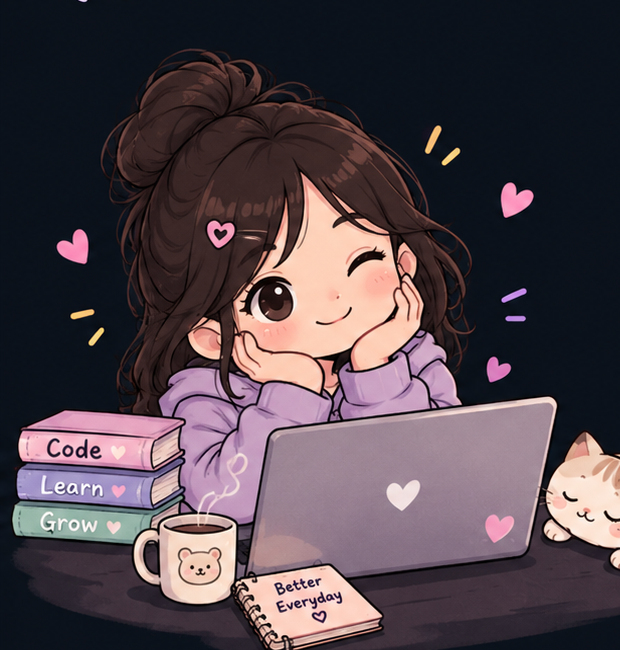

# 👋 Heyy!

I'm a Computer Science student 💻 and someone who believes that small steps can eventually build something meaningful. 🌸

I enjoy learning, creating, debugging (sometimes crying 😭), and turning random ideas into real projects. 🚀

I'm still learning, still growing, and definitely making mistakes — but that's the fun part of the journey. 🌱✨

⭐ Feel free to explore my repositories. Who knows? You might find something interesting! 💗

<!-- Cute Cartoon Girl -->

## 💌 A little message

Thank you for visiting my page! 💗

P.S.: If you liked something here, a ⭐ or a follow would genuinely make my day.  
I'm just trying to learn, build, and become a little better than yesterday. 🌷

## 🌸 Let's Connect

---

✨ *Still learning. Still building. Still becoming better every day.* 🚀💗
